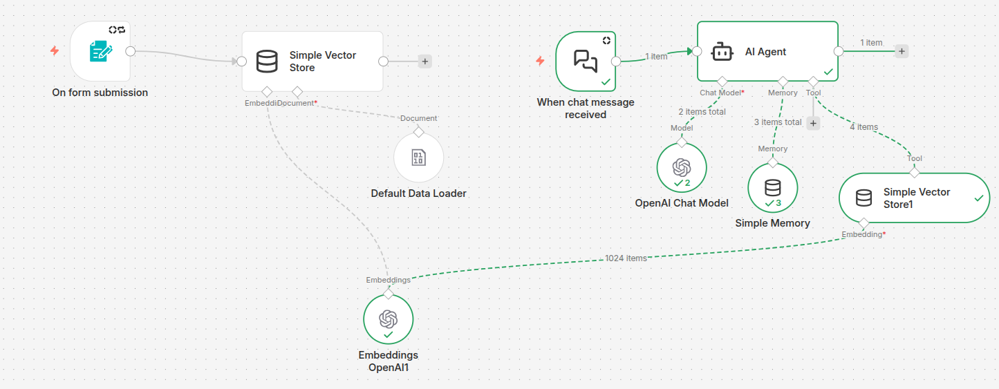
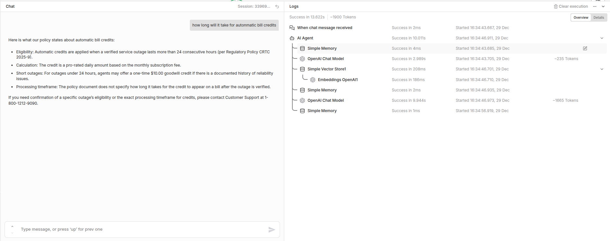
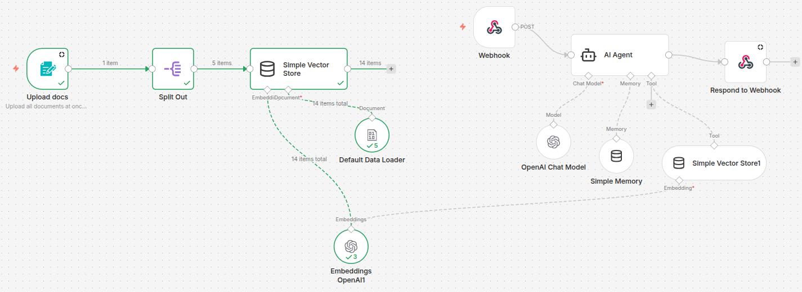

# n8n_workflow
This repo includes details related to a simple n8n workflow creation. This workflow/AI app was built mainly to red team this worklfow against open source versions giskard, garak, prompfoo adn deepeval to study various capabilities present in these tools.


Note:- I am using free, open-source version of n8n for this exploration. See license and NOTICE.md for details about re-use.

# Problem
Knowledge base(policies) customer support chatbot that can help users to provide accurate inofmration regarding services policies, regulatory requirements and other technical troubleshooting guide. <b> The chatbot doesn't have access to customer information or their accounts </b>

## Underlying technology 

An simple RAG based chatbot build using n8n feeding on unstructured data only (i.e. documents of policies). For brevity, Open AI models were used. If you want you can use Ollama models too.

Note:- The goal here is to spin up a working RAG system with somewhat hardened system prompt with a certain level accuracy confirmed via eyeballing. The workflow has not be rigorously tested for accuracy, and other factors that may affect accuracy i.e. chunk size, embedding types, custom embeddings etc.,

<b> Documents </b>
<pre>
1. ~10 documents were created using Gemini and covers 5 distinct categories.
    a. Billing and offers
    b. Home Internet and Installation
    c. Home Phone and Emergency Services
    d. Mobile Services and Packages
    e. Regulatory and Customer Rights

The  documents can be found <a href = "https://github.com/KeerthiNingegowda/n8n_workflow/tree/main/telecom_policy_docs">here</a>
</pre>


<b>Embedding model</b>
Model used:- text_embedding-3-small with 1024 dimensions.
Note that the above embedding model has dimensions upto 1536. However for memory and token efficiency it has been slightly reduced to 1024, thanks to <a href="https://arxiv.org/abs/2205.13147"> Matryoshka Representation Learning </a>

<b> Chat model </b>
Model used:- gpt-5-nano (One of the cheapest model)


# 2 modes in n8n

## Chat mode - Quick set up and easy to harden logic



Sample response


## Webhook mode - Ideal of red-teaming LLM applications at scale



Once the workflow is published you can send requests/receive responses to/from this workflow via API.

------------------------------------------------------------------------------------------------------------------------------------

## Start n8n
```
n8n start
```
## Installation
I am following the node approach. Please feel free to use the docker approach if you would like.

OS:- Ubuntu 24.04.3 LTS

```
sudo apt update
```
Install nvm
```
curl -o- https://raw.githubusercontent.com/nvm-sh/nvm/v0.39.7/install.sh | bash
```

Reload bashrc/zshrc 
```
source ~/.bashrc
```
Check nvm installation
```
nvm --version
```

Install node.js - 🚨 Note that n8n requires versions between 20.19 and 24.x, inclusive - as of December 16, 2025
```
nvm install 20
nvm use 20
nvm alias default 20
```

Verify
```
node -v
#Should say whatever version you installed
```

Install / Run n8n
```
npx n8n
```
If the above doesn't work try
```
npm install n8n -g
```
Open http://localhost:5678 in your browser


## License

- Workflow definitions in this repository are licensed under the MIT License.
- n8n itself is licensed separately. Please check out their repo here <a>https://github.com/n8n-io/n8n?tab=License-1-ov-file </a> for further info.
